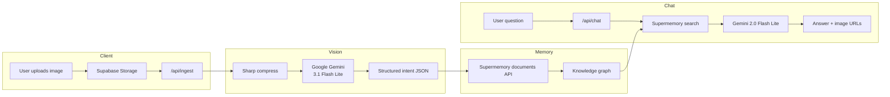

# GraspAI

**Turn piles of screenshots and images into organised information.**

GraspAI is a proactive **Intent Rescue** platform for students and professionals who capture high-value information in photos—lecture notes, job postings, event flyers, receipts—and lose it in an endless camera roll. Instead of folders and manual sorting, GraspAI **reads each image**, extracts structured intent with vision AI, stores it in a semantic knowledge graph, and surfaces what matters next on a beautiful dashboard—with a chat assistant that answers questions from your personal memories.

---

## Table of contents

- [Why GraspAI?](#why-graspai)
- [Features](#features)
- [How it works](#how-it-works)
- [Tech stack](#tech-stack)
- [Prerequisites](#prerequisites)
- [Installation](#installation)
- [Environment variables](#environment-variables)
- [Supabase setup](#supabase-setup)
- [Running the app](#running-the-app)
- [Testing the ingest pipeline](#testing-the-ingest-pipeline)
- [Project structure](#project-structure)
- [API reference](#api-reference)
- [Troubleshooting](#troubleshooting)
- [License](#license)

---

## Why GraspAI?

| Problem | GraspAI approach |
|--------|------------------|
| Screenshots pile up with no structure | **Zero-folder** AI organization by intent, subject, and `chain_id` |
| Related notes are fragmented across many images | **Semantic Stitcher** clusters images into scrollable study workspaces |
| Tasks and deadlines decay in the camera roll | **What's Next** feed prioritizes jobs, events, and urgent items |
| You can't search your own captures | **RAG chat** retrieves memories from Supermemory and answers with Gemini |

---

## Features

### Intent extraction (Google Gemini 3.1 Flash Lite)

Every upload runs through a multimodal pipeline powered by **[Google Gemini](https://aistudio.google.com/)** using **Gemini 3.1 Flash Lite**. The model analyzes the image and returns strict JSON including:

- **Intent type** — `study_material`, `job_application`, `event_attendance`, `receipt`, `contact_info`, `general_note`
- **Subject & topic** — concise labels for search and clustering
- **Entities** — deadlines, URLs, locations, key people (only when visible in the image)
- **`chain_id`** — logical slug so related captures cluster (e.g. all thermodynamics notes share one chain)
- **`priority_weight`** — 0.0–1.0 score for rescue-stack ranking
- **`suggested_action`** — proactive next step for the user
- **`logical_transition`** — how this capture connects to related content

Images are compressed server-side with **Sharp** (max 768px, JPEG) to reduce token usage. Identical uploads are **deduplicated** via content hash so repeat analysis is skipped.

### Knowledge graph (Supermemory)

After vision analysis, structured intent is pushed to **[Supermemory](https://supermemory.ai/)** with rich metadata (`url`, `subject`, `deadline`, `chain_id`, `intent`, `priority_weight`, `topic`). Supermemory builds a behavioral knowledge graph so semantically related uploads connect over time.

### Dual-feed dashboard

The home view splits your memory into two intelligent feeds:

1. **What's next?** — Horizontal story-style cards for urgent items: deadlines, high-importance captures, job applications, and events. Sorted by deadline, then importance.
2. **What you are working on** — Study materials and general notes **grouped by `chain_id`**. Multi-image clusters show a badge count; click to browse all images in the cluster with prev/next navigation.

### Other images

Receipts, contacts, and anything that doesn't belong in the main feeds land in a dedicated **Other Images** view—still searchable and clickable.

### RAG chat (“Ask Me Anything”)

Ask natural-language questions about everything you've uploaded:

1. **Supermemory** semantic search retrieves the top relevant memories.
2. **Google Gemini 2.0 Flash Lite** generates a concise answer grounded only in retrieved context.
3. Matching **inline image thumbnails** appear in the chat when relevant.

No hallucinated facts—the assistant states when something isn't in your memories.

### Upload experience

- Sidebar **Upload** button (PNG / JPG / JPEG, max 5 MB)
- Files stored in **Supabase Storage** (`grasp-moments` bucket)
- Live **“Stitching into Memory…”** indicator while ingest + Supermemory complete
- New items appear instantly in the dashboard feed (persisted with **Zustand**)

### Desktop-first UI

- Collapsible sidebar (icons → labels on hover)
- Material-inspired palette (`#1a237e`, `#e6f2ff`)
- **Framer Motion** card animations
- Full-screen **image viewer modal** with cluster navigation

---

## How it works



**Two-pass intelligence:** fast vision reasoning (Gemini) is separated from long-term memory (Supermemory) and conversational synthesis (Gemini).

---

## Tech stack

| Layer | Technology | Role |
|-------|------------|------|
| Frontend | Next.js 16 (App Router), React 19 | Dashboard, routing, API routes |
| Styling | Tailwind CSS 4, MUI 9, Framer Motion | Layout, icons, animations |
| State | Zustand (persist) | Feed items, navigation, image viewer |
| Storage | Supabase Storage | Public image URLs for memories |
| Vision / intent | **Google Gemini** — `gemini-3.1-flash-lite` | Multimodal JSON extraction |
| Memory graph | Supermemory v3 API | Ingest documents + semantic search |
| Chat answers | **Google Gemini** — `gemini-3.1-flash-lite` | Grounded responses from retrieved context |
| Image processing | Sharp | Server-side resize/compress before vision API |

---

## Prerequisites

- **Node.js** 18.18+ (20 LTS recommended)
- **npm** 9+ (or pnpm / yarn)
- Accounts & API keys for:
  - [Supabase](https://supabase.com/) (free tier works)
  - [Google AI Studio](https://aistudio.google.com/) (Gemini API key)
  - [Supermemory](https://supermemory.ai/)

---

## Installation

### 1. Clone the repository

```bash
git clone https://github.com/YOUR_USERNAME/GraspAI.git
cd GraspAI
```

### 2. Install dependencies

```bash
npm install
```

### 3. Configure environment variables

Copy the example file and fill in your keys:

```bash
cp .env.example .env.local
```

See [Environment variables](#environment-variables) below for details on each key.

### 4. Set up Supabase storage

Follow [Supabase setup](#supabase-setup) before your first upload.

### 5. Start the development server

```bash
npm run dev
```

Open [http://localhost:3000](http://localhost:3000) in your browser.

---

## Environment variables

Create `.env.local` in the project root (never commit this file):

| Variable | Required | Description |
|----------|----------|-------------|
| `NEXT_PUBLIC_SUPABASE_URL` | Yes | Supabase project URL |
| `NEXT_PUBLIC_SUPABASE_ANON_KEY` | Yes | Supabase anonymous (public) key |
| `GEMINI_API_KEY` | Yes | Google AI key for vision ingest and chat |
| `SUPERMEMORY_TOKEN` | Yes | Supermemory API bearer token |

A template is provided in [`.env.example`](.env.example).

---

## Supabase setup

1. Create a new Supabase project.
2. Go to **Storage** → create a bucket named **`grasp-moments`**.
3. Set the bucket to **Public** (or configure policies so uploaded objects get public URLs).
4. Under **Project Settings → API**, copy:
   - Project URL → `NEXT_PUBLIC_SUPABASE_URL`
   - `anon` `public` key → `NEXT_PUBLIC_SUPABASE_ANON_KEY`
5. Ensure storage policies allow **authenticated or anonymous uploads** to `grasp-moments/uploads/` (adjust RLS to match your security needs).

The upload hook writes files to `uploads/{timestamp}_{uuid}.{ext}`.

---

## Running the app

| Command | Description |
|---------|-------------|
| `npm run dev` | Start dev server at `http://localhost:3000` |
| `npm run build` | Production build |
| `npm run start` | Run production server (after `build`) |
| `npm run lint` | Run ESLint |

### Production build

```bash
npm run build
npm run start
```

Deploy to [Vercel](https://vercel.com/) or any Node host; add the same environment variables in your hosting dashboard.

---

## Testing the ingest pipeline

With the dev server running (`npm run dev`), verify the full **upload → Gemini → Supermemory** flow:

```bash
npx tsx scripts/test-ingest.ts
```

Place a test image at `scripts/complex-receipt.jpg` (or update the script path). The script POSTs to `/api/ingest` and prints extracted intent fields and Supermemory status.

Other scripts in `/scripts`:

| Script | Purpose |
|--------|---------|
| `test-ingest.ts` | End-to-end ingest API test |
| `run-eval.ts` | Batch evaluation against sample images |
| `seed-to-supabase.ts` | Seed storage with demo images |
| `test-logic.ts` | Feed clustering / sorting logic checks |

---

## Project structure

```
GraspAI/
├── public/                 # Static assets
├── scripts/                # CLI tests & eval images
├── src/
│   ├── app/
│   │   ├── api/
│   │   │   ├── ingest/     # Gemini vision + Supermemory ingest
│   │   │   └── chat/       # Supermemory RAG + Gemini answers
│   │   ├── layout.tsx
│   │   ├── page.tsx        # Main dashboard shell
│   │   └── globals.css
│   ├── components/
│   │   ├── WhatsNextFeed.tsx
│   │   ├── OtherImagesFeed.tsx
│   │   ├── ChatView.tsx
│   │   ├── ChatbotInput.tsx
│   │   └── ImageViewerModal.tsx
│   ├── hooks/
│   │   └── useUploadImage.ts
│   ├── lib/
│   │   └── supabaseClient.ts
│   └── store/
│       └── useStore.ts     # Zustand feed + viewer state
├── .env.example
├── package.json
└── README.md
```

---

## API reference

### `POST /api/ingest`

**Content-Type:** `multipart/form-data`

| Field | Type | Description |
|-------|------|-------------|
| `image` | File | JPEG / PNG image |
| `publicUrl` | string | Supabase public URL after upload |

**Response (200):**

```json
{
  "success": true,
  "analysis": { "intent": "...", "subject": "...", "chain_id": "...", "..." },
  "supermemorySuccess": true,
  "cached": false
}
```

### `POST /api/chat`

**Content-Type:** `application/json`

```json
{ "message": "What internships did I save?" }
```

**Response (200):**

```json
{
  "answer": "...",
  "images": ["https://...supabase.co/.../image.jpg"]
}
```

---

## Troubleshooting

| `GEMINI_API_KEY missing` | Add key to `.env.local`; restart dev server |
| Gemini `429` / `Quota` | Check usage limits in [Google AI Studio](https://aistudio.google.com/) |
| `SUPERMEMORY_TOKEN is missing` | Add token; required for ingest and chat |
| Upload fails / no public URL | Check Supabase bucket name `grasp-moments` and RLS policies |
| Chat returns empty context | Upload a few images first so Supermemory has documents to search |
| Images don't load in feed | Confirm Supabase URLs are public; check browser network tab |

---

## License

This project is provided as-is for demonstration and fellowship submission. Add a `LICENSE` file if you plan to open-source under a specific terms.

---

## Acknowledgments

Built for the **Activate Fellowship** vision: rescuing cognitive intent from the screenshot graveyard with high-performance multimodal AI, semantic memory, and a zero-folder user experience.
